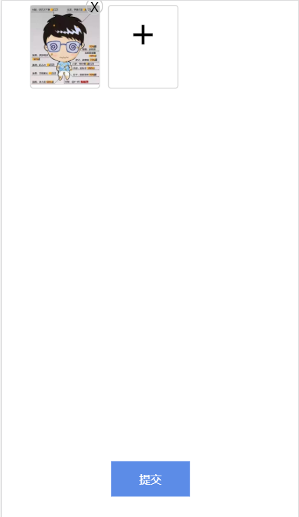

##vue移动端图片压缩FormData上传

>前段时间要图片用formdata方式上传。在之前的图片上传是转为base64，绘制canvas进行处理压缩向后端传输。这次因为项目周期比较紧张本想在网上找一个现成的，但很遗憾没有找到心仪的于是自己写了一个没有多余操作只是压缩上传的例子。



这个例子用到了`localResizeIMG`插件([传送门](https://github.com/think2011/localResizeIMG))进行图片压缩,将代码改造下可直接作为组件使用


>npm install 下载包
 npm start || npm run dev 运行

####HTML部分
```javascript
    <template>
    <div class="wrap">
        <div class="addContent" v-for="(item, index) in objImgPath" :key='index'>
            <div class="wrap_img"  >
                
            </div>
            <div class="cols" @click="getClos(index)">X</div>
        </div>
        //length是控制最多可以选择上传几张图片
        <div class="addContent" v-show="Object.keys(objImgPath).length < 3">    
            <input type="file"  accept="image/*" @change="compressImg" capture="camera" />
            <div class="add">+</div>
        </div>
        <input class="but" type="button" value="提交" @click="addCommit">
    </div>
</template>
```
####js部分
>
```javascript
<script>
import axios from 'axios'
export default {
    data(){
        return {
            formData: new FormData(),
            objImgPath: {},
            objKey: '',
        }
    },
    methods:{
        compressImg(e){
            if (e.target.files){
            lrz( e.target.files[0])  
                    .then((rst) => {
                        //newFile(file, name, ContentType)
                        let newFile = new File([rst.file],this.uuid()+'.'+rst.origin.name.split('.')[1],{ type: "multipart/form-data" })
                        this.formData.append('file', newFile)
                        //其他参数
                        this.formData.set('path', 'logo')
                        //将所选择图片set入objImgPath
                        this.$set(
                            this.objImgPath, 
                            this.key = rst.origin.name,
                            rst.file
                        )
                        //成功时执行
                    }).catch((error) => {
                        console.log(error)
                        //失败时执行
                    }).always(() =>  {
                        //不管成功或失败，都会执行
                    })
            };
        },
        uuid() {
            var s = [];
            var hexDigits = "0123456789abcdef";
            for (var i = 0; i < 36; i++) {
                s[i] = hexDigits.substr(Math.floor(Math.random() * 0x10), 1);
            }
            s[14] = "4"; 
            s[19] = hexDigits.substr((s[19] & 0x3) | 0x8, 1);
            s[8] = s[13] = s[18] = s[23] = "-";
            var uuid = s.join("");
            return uuid.replace(/-/g,"")
        },
        //删除图片操作
        getClos(index){
            delete this.objImgPath[index]
            this.$forceUpdate()
        },
        // 接收图片源信息， 转成路径
        getObjectURL(file) {
            var url = null;
            if (window.createObjectURL != undefined) {
                // basic
                url = window.createObjectURL(file);
            } else if (window.URL != undefined) {
                // mozilla(firefox)
                url = window.URL.createObjectURL(file);
            } else if (window.webkitURL != undefined) {
                // webkit or chrome
                url = window.webkitURL.createObjectURL(file);
            }
            return url;
        },
        //提交
        addCommit(){
            let url = ''
            axios.post(url, this.formData).then( (res) => {
                console.log(res)
            })
        }
    }
}
</script>
```

####css部分
```javascript
<style scoped>
.wrap{
    display: flex;
    padding-left: 30px;
    flex-wrap: wrap;
    position: relative;
}
.addContent{
    width:87px;
    height:104px;
    border-radius:4px;
    border:1px solid rgba(219,219,219,1);
    position: relative;
    text-align: center;
    margin:5px;
}
.addContent .add{
    font-size: 50px;
}
.addContent .cols{
    width:20px;
    height:20px;
    font-size: 16px;
    position: absolute;
    top:-10px;
    right:-5px;
    border:1px solid #ccc;
    border-radius: 50%;
}
.addContent input{
    width:100%;
    height:100%;
    opacity: 0;
    position: absolute;
    top:0;
    left:0;
}
.wrap_img{
    overflow: hidden;
    width:100%;
    height:100%;
    position: absolute;
    top:50%;
    left:0;
    transform: translateY(-50%);
}
.wrap_img img{
    width:100%;
    height:auto;
}
.but{
    width:100px;
    height:45px;
    display: block;
    position: fixed;
    bottom: 40px;
    left:50%;
    transform: translateX(-50%);
    border:0;
    background: #5c8ce7;
    font-size: 14px;
    color:#fff;
}
</style>

```

